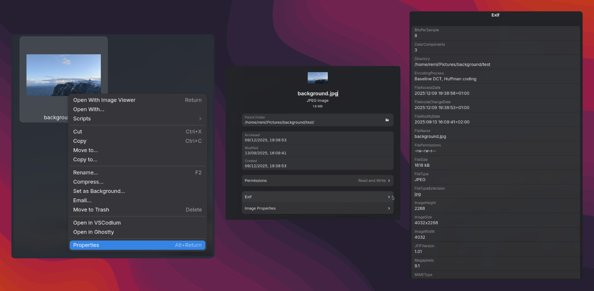

<center>
<h1>Nautilus/Caja EXIF Viewer</h1>
</center>

<center>
    
    <!-- 
    
     -->
</center>


>A Python extension for **Nautilus** and **Caja** that adds an **"Show EXIF"** entry to the context menu (right-click → Properties) to display all EXIF metadata of image files.

## ✨ Features

- Displays EXIF metadata for image files (JPEG, PNG, TIFF, etc.).
- Native integration into Nautilus (GNOME) and Caja (MATE) context menus.
- Supports common image formats.
- Clear and structured EXIF data display.

## 📦 Installation

### 1. Dependencies

Make sure you have installed:
- Python 3
- `python3-nautilus` (for Nautilus) or `python3-caja` (for Caja)
- `Exiftool`

On Fedora/Rpm distro:
```bash
sudo dnf install python3-nautilus python3-caja exiftool
```

On Debian/Ubuntu:
```bash
sudo apt install python3-nautilus python3-caja exiftool
```

### 2. install extension
```bash
pip install nautils_exiftool
```

### 3. Restart Nautilus/Caja:
```bash
nautilus -q  # For Nautilus
caja -q     # For Caja
```


# 📜 License
This project is licensed under the MIT License.